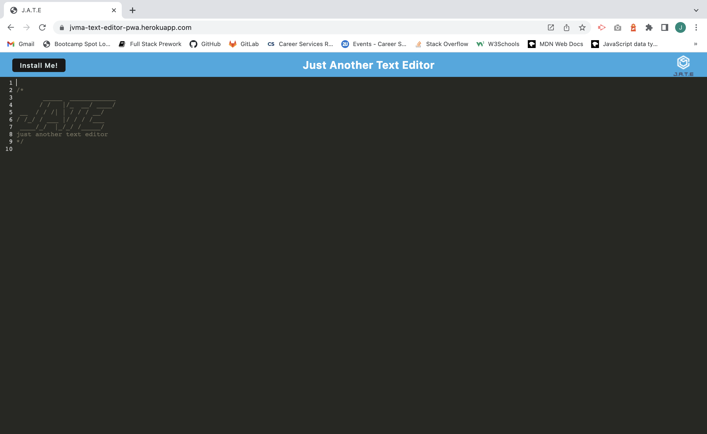

# jvma-text-editor-pwa
Progressive Web Application (PWA) of a Text Editor that runs in the browser and also works offline.

## Description

This was an on-the-job ticket activity where I was given several files with some code already written (server.js, htmlRoutes.js, src-sw.js, index.html, database.js, editor.js, header.js, index.js, install.js, style.css, webpack.config.js, package.json, sever/package.json, client/package.json). My task was to write additional code in several files to build a text editor that runs in the browser, is a single-page application and meets the Progressive Web Application (PWA) criteria (this is achieved using Webpack). This application also features many data persistence techniques (like IndexedDB with the idb package and Service Workers with Workbox), which allows it to work even offline.

To begin I added some code in the root directory's package.json, defining the scripts for "start:dev", "start", "server", "build", "install" and "client". After this, I proceeded to add code to client/webpack.config.js, configuring several plugins like HtmlWebpackPlugin, InjectManifest and WebpackPwaManifest. In this webpack.config.js file I also added code for the CSS and Babel loaders. 

The next step was to add code to the database.js file, defining the logic for two methods, `putDb()`, which accepts content and adds it to the database, and `getDb()`, that gets all the content from the database and updates the specified key. For the `getDb()` method I had to add an `if` statement to check if the read result is `undefined`, if it isn't then the method returns the `result.value`, to be injected in the text editor.

Then, I wrote some code in the install.js file to define the logic for the `beforeinstallprompt` event, implement a click event handler and add a handler for the `appinstalled` event. 

Finally, I added some code to the src-sw.js file, where first I implemented the asset caching logic using the `StaleWhileRevalidate()` strategy for the `asset-cache`. After this, I also wrote the logic for the `image-cache` for image caching, again using `StaleWhileRevalidate()` strategy. 

## Usage

Here are some images of the application in use:

 

## Technologies Used

* JavaScript
* HTML
* CSS
* Node.js
* NPM
* IndexedDB
* Webpack
* Webpack-cli
* Webpack-dev-server
* Webpack-pwa-manifest
* Workbox-webpack-plugin
* HTML-webpack-plugin
* Babel
* CSS-loader
* Express package
* Idb package
* Code-mirror-themes
* Heroku

## Contact Information

* GitHub Profile: [josevidmal](https://github.com/josevidmal)
* email: josevidmal@gmail.com

## License

[The MIT License](https://www.mit.edu/~amini/LICENSE.md)

Copyright 2022 Jose Vidal

Permission is hereby granted, free of charge, to any person obtaining a copy of this software and associated documentation files (the "Software"), to deal in the Software without restriction, including without limitation the rights to use, copy, modify, merge, publish, distribute, sublicense, and/or sell copies of the Software, and to permit persons to whom the Software is furnished to do so, subject to the following conditions:
    
The above copyright notice and this permission notice shall be included in all copies or substantial portions of the Software.
    
THE SOFTWARE IS PROVIDED "AS IS", WITHOUT WARRANTY OF ANY KIND, EXPRESS OR IMPLIED, INCLUDING BUT NOT LIMITED TO THE WARRANTIES OF MERCHANTABILITY, FITNESS FOR A PARTICULAR PURPOSE AND NONINFRINGEMENT. IN NO EVENT SHALL THE AUTHORS OR COPYRIGHT HOLDERS BE LIABLE FOR ANY CLAIM, DAMAGES OR OTHER LIABILITY, WHETHER IN AN ACTION OF CONTRACT, TORT OR OTHERWISE, ARISING FROM, OUT OF OR IN CONNECTION WITH THE SOFTWARE OR THE USE OR OTHER DEALINGS IN THE SOFTWARE.